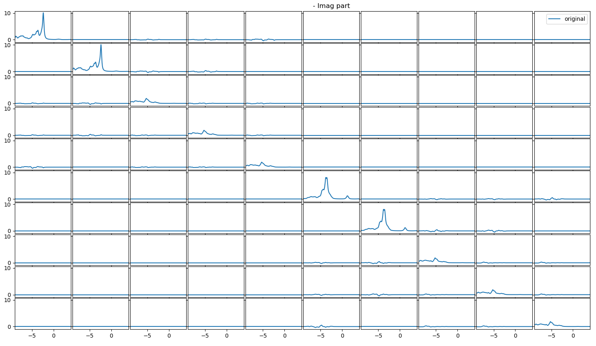
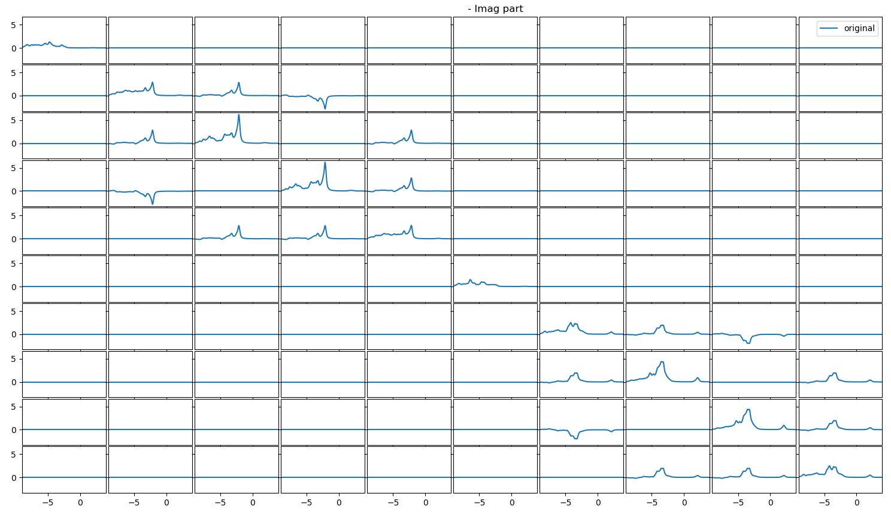
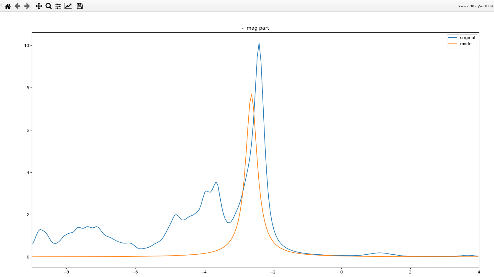

# Fit the hybridization function
To fit the hybrization function you need the files `imag-hyb-`basistag, `real-hyb-`basistag, `out` (that produced the hyb files), `finiteH0.py` and `rspt2spectra_parameters.py` in the same folder. 
If you want to look at the spectra of multiple sides, it is adviced to mak sub folders for every interesting site, so that you do not override the spectra, the file for the hamiltonian and can keep the fitting script constant.
## Check for offdiagonal elements
When starting the fitting proceedure, you first want to check if there are offdiagonal elements in the hybridization function. 
For this open the `rspt2spectra_parameters.py` file you should see
````

#!/usr/bin/env python3
"""
rspt2spectra_parameters
=======================
This file contains material specific information needed by the finiteH0.py script. Put this file in the RSPt simulation folder. Then execute the finiteH0.py script (which will read this file).
"""
import numpy as np
from rspt2spectra.constants import eV
basis_tag ='Eu'
irr_flag = ''
eim = 0.010*eV
cubic=True
# Verbose parameters. True or False
verbose_fig = True
verbose_text = True
# Plot energy range. Only used for plotting.
xlim = (-9, 4)

````
This at the top of the file, here  
-`basis_tag` is the name that the cluster has that you want to open  
-`irr_flag` is the flag of the irreducible transformation you applied to the cluster. If you did not specify one leave it blank  
-`eim` is a broadening parameter, it should match the one specified in `BRIANNA` in `out`. Sometimes when the states are very close you can also make it slightly larger.  
-`cubic` should be set to True if you used basisset 3 and false if it is set to 0. (This was implemented so one can use Id flags in RSPt)  
-`verbose_fig` if set to True it will print an overview of all spectra, if set to False it will skip to your fits instead  
-`verbose_text` if set to True it will print information such as the hopping matrix in the terminal  
-`xlim` sets your plotting range, it is limited by the energywindow and the energymesh set in RSPt as all elements outside of them should be 0. But usually the interesting peaks are closer to the Fermi energy.
  For now make sure that your `basis_tag` is set correctly to either `Eu` or `Bare` and that `verbose_fig=True`.
  Now run
  ````
./finiteH0.py
````
And close the windows until you see the overview of the entire hybridization of all orbitals it should look like

or  


Here, we can see that the offdiagonal elements are much smaller when we use the Euler angles. So small in fact that we can neglect their contribution. This makes it much easier to fit them, so we will start with them.
Now, we stop `finiteH0.py` by pressing ``ctrl+c`` in the terminal and open `rspt2spectra_parameters.py` again. For convenience, set `verbose_fig=False` and make sure that `basis_tag='Eu'` is set so that you open the correct file.
To only fit the diagonal elements of the hybridization function go to the `blocks` part of the script. and set it to
````
blocks =(np.array([0]),  
        np.array([1]),  
        np.array([2]),  
        np.array([3]),  
        np.array([4]),  
        np.array([5]),  
        np.array([6]),  
        np.array([7]),  
        np.array([8]),  
        np.array([9]))  
````
And make sure that `n_bath_sets_foreach_block_and_window` has 10 lists, which could look like this
````
n_bath_sets_foreach_block_and_window=np.array([[1, 0, 0, 0, 0],  
[1, 0, 0, 0, 0],  
[0, 1, 0, 0, 0],  
[0, 0, 1, 0, 0],  
[0, 0, 0, 1, 0],  
[0, 0, 0, 0, 1],  
[0, 0, 0, 1, 0],
[0, 0, 0, 1, 0],
[0, 0, 0, 1, 0],  
[0, 0, 1, 0, 0]])
````
Here, the number of 0s and 1s separated by a comma has to match the number of lists specified in `wborders`. 
## The actual fitting
Now let us get into the actual fitting procedure. So run 
```
./finiteH0.py
```
again. It should skip to a window with an orange and a blue line. If you did not set `verbose_fig=False` just close the windows until you arrive at the first one that matches this description.
This is the real part of the hybridization function of the first block we set so for orbital 0. As the imaginary part is more interesting for us, we can also close that. 
A similar window should open, which should look like 
  

Here, we can see that there is one peak in the original Hybridization function. Move your pointer to the peak and you can see the exact position written in the top right corner. Write down the x value, this is what we want to use as the centre 
of our bath state to fit the hybridization function. Now, you can close the window and the following until you arrive at the next window with these two lines and imag part written on top. Again look for the biggest peak write down the x value
and close the window. Repeat until for all of the 10 orbitals. Your 10 x values should be approximately:  
-`-2.39`,`-2.39`  
-`-5.27`,`-5.27`, `-5.27`  
-`-3.65`, `-3.65`  
-`-5.2`, `-5.2`, `-5.2`  
We can see that the hybridization function is functionally identical for the two $`e_g`$ and three $`t_{2g}`$ orbitals. This does not always have to be the case, which is why it is advised to write down all 10 x values.
Now, let us fit these peaks using bath states for this we want to go into `rspt2spectra_parameters.py` again and edit the `wborders` to
````
wborders = np.array([[-1.22, -0.82],
[-3.89, -3.49],
[-2.35, -1.95],
[-3.8, -3.4],
[-2.3, -1.9]], dtype=np.float)
````
Note that the first lists contain two numbers. The first number is 0.2 eV lower and the second number is 0.2 eV higher than the x values we wrote down. The last border is unrelated to our fit and just a remnant of a previous fit.
It is left here to illustrate a point and should not be used for the fitting. As previously mentioned the numbers in the `n_bath_sets_foreach_block_and_window` correspond the lists in `wborders`. Now, we will edit them to use the 
first borders for the bath state in the orbitals 0 and 1, the second in 2,3 and 4. The third should be used in 5 and 6 and the fourth should be used for the last three, while the fifth should be switched off for all. For this we just write a 1 
when we want to include 1 bath state between these borders and 0 if it should not be used for the fitting. It should now look like
````
n_bath_sets_foreach_block_and_window = np.array([[1, 0, 0, 0, 0],
[1, 0, 0, 0, 0],
[0, 1, 0, 0, 0],
[0, 1, 0, 0, 0],
[0, 1, 0, 0, 0],
[0, 0, 1, 0, 0],
[0, 0, 1, 0, 0],
[0, 0, 0, 1, 0],
[0, 0, 0, 1, 0],
[0, 0, 0, 1, 0]])

````
You can also put multiple bath states into the same borders by writing for example 2 instead of one. Then the bath states will be placed equidistant in this interval, which might be helpful for some fits, but generally, it is easier to control
the fitting if you use only 1 bath state per border. After our changes, we can run `finiteH0.py` again and see if the fit of the hybridization function has improved. The orange line should now match the blue one decently at the biggest peak.
This is enough to calculate the thermal ground state and the spectra of the system for an overview. But for publications, you want to include more bath states.
### More bath states
In this tutorial, we will only include 2 bath states per correlated orbital, but after going from 1 to 2 you can use the same steps to get from 2 to 3 and so on.
First, we again need to run `finiteH0.py` and find the x values of peaks we want to fit. At this point, it is a good idea to include states that are closer to the fermi energy as the electrons can be exchanged easier there.
Also the $`e_g`$ spin up channel showed a double peak, so it might be good to include two bath states in the same borders and make them wider instead so that the borders don't overlap.
Using the new borders for the bath states it should look like
````
wborders = np.array([[-1.22, -0.82],
[-2.46, -2.06],
[-3.89, -3.49],
[-1.81,-1.41],
[-2.6, -1.85],
[-3.8, -3.4],
[-1.76, -1.36]], dtype=np.float)

````
Given that we had to add two new lists we also have to increase the number of elements per list in `n_bath_sets_foreach_block_and_window` by two. Furthermore, now that we are using two bath states per orbital we also need to switch them on.
In the first two orbitals we want to put a bath state in the first two borders. While in 5 and 6 we just increased the width of the interval between the borders to place two bath states into this interval. The resulting `n_bath_sets_foreach_block_and_window` 
should look like
````

n_bath_sets_foreach_block_and_window = np.array([[1, 1, 0, 0, 0, 0, 0],
[1, 1, 0, 0, 0, 0, 0],
[0, 0, 1, 1, 0, 0, 0],
[0, 0, 1, 1, 0, 0, 0],
[0, 0, 1, 1, 0, 0, 0],
[0, 0, 0, 0, 2, 0, 0],
[0, 0, 0, 0, 2, 0, 0],
[0, 0, 0, 0, 0, 1, 1],
[0, 0, 0, 0, 0, 1, 1],
[0, 0, 0, 0, 0, 1, 1]])
`````
Now, this should have improved the agreement between the original and the fit hybridization function a bit and hopefully increased the agreement of the theoretical spectra to the experiment.
You can now increase the bath states to the number of bath states at which the spectra you are interested in converge. However, there are still some small tips I want to give.
Given that the second bath state in the up and down $`t_{2g}`$ orbitals are so close you can use the same borders for them. In this case, write `n_bath_sets_foreach_block_and_window` instead as
````

n_bath_sets_foreach_block_and_window = np.array([[1, 1, 0, 0, 0, 0, 0],
[1, 1, 0, 0, 0, 0, 0],
[0, 0, 1, 1, 0, 0, 0],
[0, 0, 1, 1, 0, 0, 0],
[0, 0, 1, 1, 0, 0, 0],
[0, 0, 0, 0, 2, 0, 0],
[0, 0, 0, 0, 2, 0, 0],
[0, 0, 0, 1, 0, 1, 0],
[0, 0, 0, 1, 0, 1, 0],
[0, 0, 0, 1, 0, 1, 0]])
````
Second, you do not need to use the same number of bath states to fit the hybridization function of all orbitals. Note the intensity scale on the left side. Or look at the full plot of the hybridization function. The largest peak in the
hybridization of the $`t_{2g}`$ orbitals is smaller than the peaks that we still ignore in the $`e_g`$ orbitals. So it might be better to use 3 bath states for the $`e_g`$ orbitals and only 1 for the $`t_{2g}`$ orbitals, while having similar computational costs
as using 2 bath states for all.
## Including offdiagonal elements
Now, let us fit the hybridization function when we have offdiagonal elements. For this let us again open `rspt2spectra_parameters.py`. Now, set `basis_tag='Bare'`. Given that we see offdiagonal elements between the orbitals 1,2,3 and 2,3,4
in the first spin channel and 6,7,8 and 7,8,9 in the second spin channel, we set the `blocks` to
````

blocks =(np.array([0]),    
        np.array([1,2,3,4]),    
        np.array([5]),   
        np.array([6,7,8,9])  


````
And as the number of lines in the `n_bath_sets_foreach_block_and_window` has to match the number of lines in `blocks` we set it to something like:
````
n_bath_sets_foreach_block_and_window = np.array([[1, 0, 0, 0, 0],
[1, 0, 0, 0, 0],
[0, 1, 0, 0, 0],
[0, 0, 1, 0, 0]])

````
or if you put followed the part using multiple bath states
````
n_bath_sets_foreach_block_and_window = np.array([[1, 1, 0, 0, 0, 0, 0],
[1, 1, 0, 0, 0, 0, 0],
[0, 0, 1, 1, 0, 0, 0],
[0, 0, 0, 0, 0, 1, 1]])

````
Now, run 
````
./finiteH0.py
````
again and choose your bath states according to the shape of this new shape of the hybridization function.
